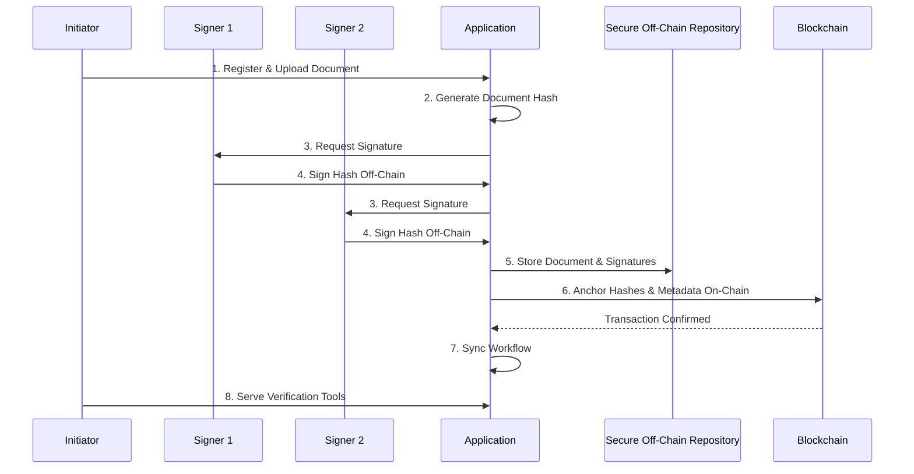

# Hybrid Model: Multi-Signature

This document outlines the step-by-step flow for a multi-signature workflow in a hybrid model. This process is designed for scenarios requiring agreement from multiple parties, combining the security of off-chain signature management with the immutability of an on-chain, timestamped proof.

## Process Overview

The multi-signature hybrid model coordinates a signing process among several users. Each user signs a common document hash off-chain. Once all required signatures are collected, the document hash and a collective proof of signatures are anchored to the blockchain.

## Step-by-Step Flow

### 1. Register and Prepare Document
The process begins when an authenticated user uploads a document and specifies the required signers.

*   **Action:** An initiator, who is a verified user, uploads a document and invites multiple signers by their enterprise identities.
*   **Example:** A project manager uploads a "Supplier Agreement.pdf" and adds the Head of Procurement and the Chief Financial Officer (CFO) as required signers.

### 2. Generate Document Hash
A unique cryptographic hash of the document is created to serve as its digital fingerprint.

*   **Action:** The application computes a SHA-256 hash of the "Supplier Agreement.pdf".
*   **Example:** Document Hash: `0x1a2b3c...`

### 3. Request Signatures
The application notifies each required signer that their signature is requested.

*   **Action:** The system sends a notification (e.g., email, in-app alert) to each signer with a link to review and sign the document.
*   **Example:** The Head of Procurement and the CFO receive emails requesting their signatures on the "Supplier Agreement.pdf".

### 4. Sign Document Hash Off-Chain
Each signer independently signs the document hash using their private key.

*   **Action:** Each signer accesses the document via the application, reviews it, and uses their integrated wallet or secure key store to sign the hash (`0x1a2b3c...`).
*   **Example:**
    *   The Head of Procurement signs the hash, producing Signature 1: `0x4d5e6f...`
    *   The CFO signs the hash, producing Signature 2: `0x7g8h9i...`

### 5. Store Document and Signatures Off-Chain
The original document and the collected signatures are stored securely off-chain.

*   **Action:** The application collects all signatures and stores them alongside the original document in a secure repository.
*   **Example:** The "Supplier Agreement.pdf" and the two signatures (`0x4d5e6f...`, `0x7g8h9i...`) are stored in a version-controlled folder in an enterprise cloud storage account, linked to a single document record in a database.

### 6. Anchor Hash (and Metadata) On-Chain
Once all signatures are collected, a single transaction is created on the blockchain to anchor the proof.

*   **Action:** The application creates a transaction containing the document hash, a list of the signers' public keys (or a Merkle root of the signatures), and a pointer to the off-chain storage location.
*   **Example:** A transaction is sent to a smart contract on Polygon with the following data:
    *   `documentHash`: `0x1a2b3c...`
    *   `signers`: `['0xProcurement...', '0xCFO...']`
    *   `storagePointer`: `s3://bucket/SupplierAgreement.pdf`
    *   This transaction creates an immutable, timestamped record confirming that multiple parties have signed off on the document.

### 7. Sync Workflow Between Systems
The on-chain event triggers updates in the off-chain system to reflect the completed workflow.

*   **Action:** A `DocumentFullySigned` event from the smart contract triggers an API bridge to update the document's status in the application's database.
*   **Example:** The status of the "Supplier Agreement.pdf" is updated from `Awaiting Signatures` to `Completed and Anchored`.

### 8. Serve Verification Tools
The application provides a tool for any party to verify the document and its signatures.

*   **Action:** A verification page allows a user to upload the document. The tool re-calculates the hash, finds the corresponding on-chain transaction, and validates all associated signatures.
*   **Example:** An external auditor uploads the "Supplier Agreement.pdf". The verification tool confirms that its hash is recorded on the blockchain and that the signatures from both the Head of Procurement and the CFO are valid for that hash.

## Required Services

*   **Blockchain:** A smart contract-enabled blockchain (e.g., Ethereum, Polygon) to manage the multi-signature logic and anchor proofs.
*   **IPFS/Secure Off-Chain Storage:** A secure repository for storing documents and individual signatures.
*   **Identity Management:** An identity provider for authenticating the initiator and all signers.
*   **API Bridges/Oracles:** Middleware to sync state between the blockchain and off-chain systems.
*   **Secure Key Store:** A secure wallet or key management system for each signer.
*   **Notification Service:** A service (e.g., SendGrid, AWS SNS) to alert signers when their action is required.