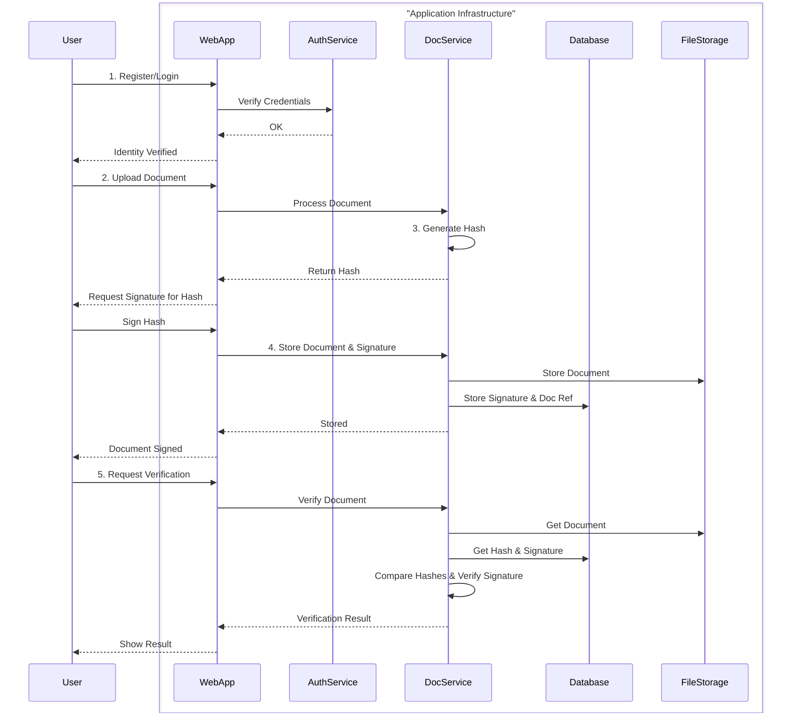

# Off-Chain Document Signing: Single Signature

This document outlines the process for signing a document off-chain using a single digital signature. This method ensures document integrity and authenticity without requiring every transaction to be recorded on a blockchain, making it a cost-effective and efficient solution.

## Process Overview

The following diagram illustrates the key steps involved in the off-chain single signature process:

## Step-by-Step Guide

### 1. Register and Verify User Identity

Before a user can sign a document, their identity must be established and verified. This is a crucial step to ensure the signature is legally binding and attributable to a specific individual.

*   **Action:** The user registers for an account and completes an identity verification process (e.g., email verification, KYC).
*   **Example:** A user signs up on the platform and provides their email address. They receive a verification link, which they must click to activate their account. For higher-value transactions, this could involve uploading a government-issued ID.

### 2. Upload/Prepare Document

The user uploads the document they intend to sign. The application prepares the document for the signing process.

*   **Action:** The user selects a document (e.g., PDF, DOCX) from their local device and uploads it to the application.
*   **Example:** A user uploads a "Non-Disclosure Agreement.pdf" to the application's web interface.

### 3. Generate Document Hash and Sign

To ensure the integrity of the document without storing the entire file on-chain, a unique cryptographic hash of the document is generated. This hash acts as a digital fingerprint.

*   **Action:** The application computes a SHA-256 hash of the document's content. The user then signs this hash with their private key.
*   **Example:**
    *   Document Content: "This is the content of the NDA."
    *   SHA-256 Hash: `f2ca1bb6c7e907d06dafe4687e579fce76b37e4e93b7605022da52e6ccc26fd2`
    *   The user's wallet prompts them to sign this hash. The resulting signature is a unique string of characters.

### 4. Store Document and Signature Off-Chain

The original document and the generated signature are stored in a secure off-chain storage solution.

*   **Action:** The application stores the document and its corresponding signature in a database or a distributed file system like IPFS.
*   **Example:** The "Non-Disclosure Agreement.pdf" and its signature are stored in an AWS S3 bucket, with a reference to the transaction stored in a PostgreSQL database.

### 5. Serve Verification Tools

The application provides tools for anyone to verify the authenticity and integrity of the signed document.

*   **Action:** A verification tool allows a user to upload a document. The tool re-calculates the hash of the uploaded document and compares it with the hash stored in the application's database. It also verifies the signature against the user's public key.
*   **Example:** A third party receives the signed NDA. They upload it to the verification page. The system computes the hash, retrieves the stored hash from the database, and confirms they match. It then uses the signer's public key to verify the signature, confirming the document is authentic and has not been tampered with since it was signed.
## Required Services

*   **Identity Provider:** An authentication service (e.g., SSO, OAuth, or email verification) to verify user identities.
*   **Secure Off-Chain Storage:** A reliable storage solution (e.g., AWS S3, Google Cloud Storage, or a private server) to hold the original documents.
*   **Database:** A database system (e.g., PostgreSQL, MySQL) to store metadata, document references, and signatures.
*   **Digital Wallet/Key Management:** A system for users to securely manage their private keys and create digital signatures.