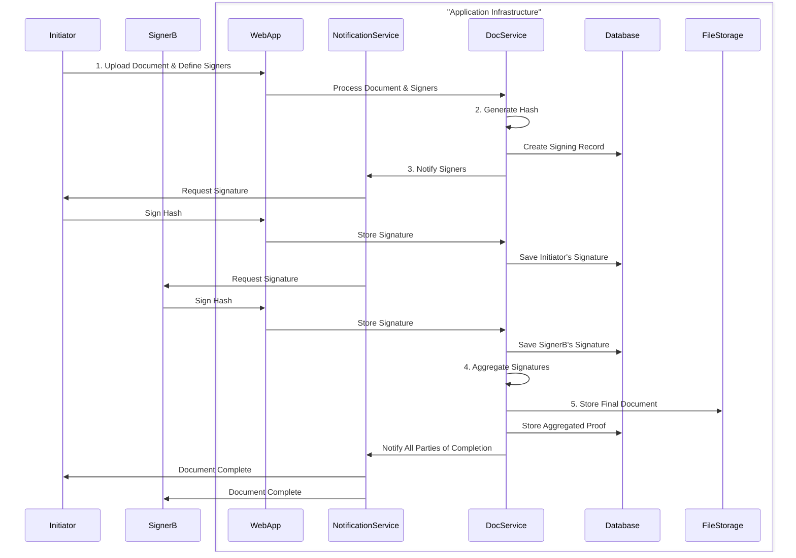

# Off-Chain Document Signing: Multi-Signature

This document describes the process for signing a document off-chain using multiple digital signatures (multi-signature). This approach is essential for agreements that require approval from several parties, ensuring that all required participants have provided their consent before the document is considered fully executed.

## Process Overview

The multi-signature process involves sequential or parallel signing by multiple users. Each signature is collected and stored before the document is finalized.



## Step-by-Step Guide

### 1. Initiate Document and Define Signers

The process begins when a user uploads a document and specifies all the required signers.

*   **Action:** The initiating user uploads a document and provides the identities (e.g., email addresses) of all parties required to sign. The application creates a record of the signing process, linking the document to the specified signers.
*   **Example:** A project manager uploads a "Service Level Agreement.pdf" and invites the client representative and the internal legal counsel to sign.

### 2. Generate Document Hash

A single, consistent cryptographic hash of the document is generated. All parties will sign this same hash to ensure they are all agreeing to the exact same document content.

*   **Action:** The application computes a SHA-256 hash of the document.
*   **Example:**
    *   Document Content: "This is the Service Level Agreement..."
    *   SHA-256 Hash: `e3b0c44298fc1c149afbf4c8996fb92427ae41e4649b934ca495991b7852b855`

### 3. Collect Signatures Sequentially or in Parallel

The application requests signatures from each required party. This can be configured to happen in a specific order (sequentially) or all at once (in parallel).

*   **Action:** The application notifies each signer that their signature is requested. Each user reviews the document and signs the hash using their private key.
*   **Example:**
    *   The application sends an email to the client representative. The client clicks a link, reviews the SLA, and signs the hash.
    *   Next, the application notifies the legal counsel, who also reviews and signs the same hash.

### 4. Store Individual Signatures

As each signature is collected, it is stored in an off-chain storage system, linked to the document and the respective signer.

*   **Action:** Each signature is stored in a database, associated with the document's unique ID and the signer's user ID.
*   **Example:** The database now contains two signature entries for the "Service Level Agreement.pdf", one from the client and one from the legal counsel.

### 5. Aggregate Signatures and Finalize

Once all required signatures have been collected, the application aggregates them. This "bundle" of signatures serves as the complete proof of execution.

*   **Action:** The application compiles all individual signatures into a single data structure (e.g., a JSON object or an array) associated with the document.
*   **Example:**
    ```json
    {
      "document_hash": "e3b0c44298fc1c149afbf4c8996fb92427ae41e4649b934ca495991b7852b855",
      "signatures": [
        {
          "signer": "client@example.com",
          "signature": "0xabc...",
          "timestamp": "2023-10-27T10:00:00Z"
        },
        {
          "signer": "legal@company.com",
          "signature": "0xdef...",
          "timestamp": "2023-10-27T11:30:00Z"
        }
      ]
    }
    ```

### 6. Store Final Document and Provide Verification

The final document, along with the aggregated signatures, is stored securely. Verification tools are provided to allow any party to validate the document's authenticity and confirm that all required signatures have been provided.

*   **Action:** The final document and the aggregated signature data are stored. A verification tool allows users to upload the document, and the system checks each signature against the document hash and the respective public keys of the signers.
*   **Example:** An auditor can upload the SLA. The system re-calculates the hash, confirms it matches the one that was signed, and then validates each signature in the aggregated list, proving the document's integrity and the consent of all parties.
## Required Services

*   **Identity Provider:** An authentication service to verify the identities of all signatories.
*   **Secure Off-Chain Storage:** A robust storage solution for documents and collected signatures.
*   **Database:** A database to manage the multi-signature workflow, track signer status, and store aggregated proofs.
*   **Digital Wallet/Key Management:** A secure key management system for each participant.
*   **Notification Service:** A service (e.g., email, SMS) to alert signatories when their action is required.