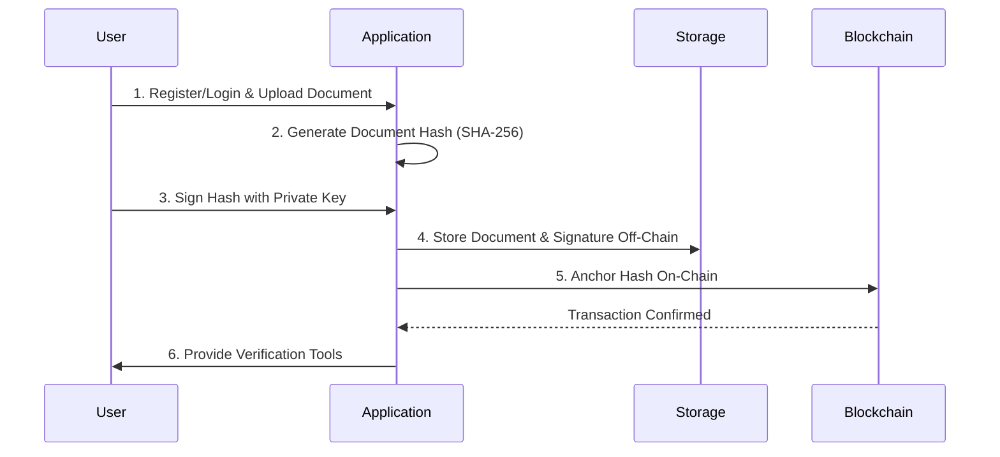

# Blockchain-Anchored Signing: Single Signature

This document outlines the process for anchoring a document signed with a single signature to a public blockchain. This hybrid approach combines the efficiency of off-chain storage with the immutability and timestamping capabilities of a blockchain, providing a high level of trust and verifiability.

## Process Overview

The process involves generating a signature off-chain and then recording a hash of the document on-chain to act as a permanent, verifiable proof of existence.

## Step-by-Step Guide

### 1. Register and Prepare Document

The user must be authenticated, and the document must be uploaded to the system.

*   **Action:** A verified user uploads a document to the application.
*   **Example:** A freelance designer logs into their account and uploads a "Design Contract.pdf".

### 2. Generate Document Hash

A unique cryptographic hash of the document is created. This hash serves as the document's digital fingerprint for all subsequent operations.

*   **Action:** The application computes a SHA-256 hash of the "Design Contract.pdf".
*   **Example:**
    *   Document Hash: `a1b2c3d4...`

### 3. Sign the Hash Off-Chain

The user signs the document hash with their private key. This action is performed off-chain to ensure speed and avoid transaction fees for the signing step itself.

*   **Action:** The user's wallet prompts them to sign the hash (`a1b2c3d4...`). The resulting digital signature is sent back to the application.
*   **Example:** The designer uses their MetaMask wallet to sign the hash, creating a unique signature string like `0x123...`.

### 4. Store Document and Signature Off-Chain

The original document and the signature are stored in a conventional, centralized, or distributed off-chain storage system for easy retrieval.

*   **Action:** The application stores the "Design Contract.pdf" and the signature `0x123...` in a secure storage solution like IPFS or AWS S3.
*   **Example:** The document is stored at `ipfs://Qm...` and the signature is recorded in a database entry linked to the document's IPFS hash.

### 5. Anchor Hash On-Chain

This is the core step of the blockchain-anchored approach. The hash of the document is recorded on a public blockchain.

*   **Action:** The application creates a transaction on a blockchain (e.g., Ethereum, Polygon, or a dedicated document-centric chain) and includes the document hash (`a1b2c3d4...`) in the transaction's data field.
*   **Example:** A transaction is sent to the Polygon network. The transaction details include:
    *   `from`: Application's wallet address
    *   `to`: A smart contract or an EOA (Externally Owned Account) for record-keeping
    *   `data`: `a1b2c3d4...`
    *   Once this transaction is mined, the hash is permanently recorded in a block, complete with a verifiable timestamp.

### 6. Provide Verification Tools

The application provides a public-facing tool for anyone to verify the document's authenticity and its timestamp.

*   **Action:** A verification page allows a user to upload a document. The tool performs the following checks:
    1.  It re-calculates the hash of the uploaded document.
    2.  It queries the blockchain to find the transaction containing this hash.
    3.  It retrieves the timestamp of the block containing the transaction.
    4.  It verifies the off-chain signature using the signer's public key.
*   **Example:** The client who received the "Design Contract.pdf" can upload it to the verification portal. The portal confirms that the document's hash exists on the Polygon blockchain and was recorded at a specific time. It also validates the designer's signature, proving the document is authentic, unaltered, and existed at a certain point in time.
## Required Services

*   **Blockchain:** A public or private blockchain (e.g., Ethereum, Polygon) to anchor the document hash.
*   **Secure Off-Chain Storage:** A storage solution (e.g., IPFS, AWS S3) for the original document.
*   **Identity Provider:** An authentication service to verify the signer's identity.
*   **Digital Wallet/Key Management:** A secure wallet for the user to sign the document hash.