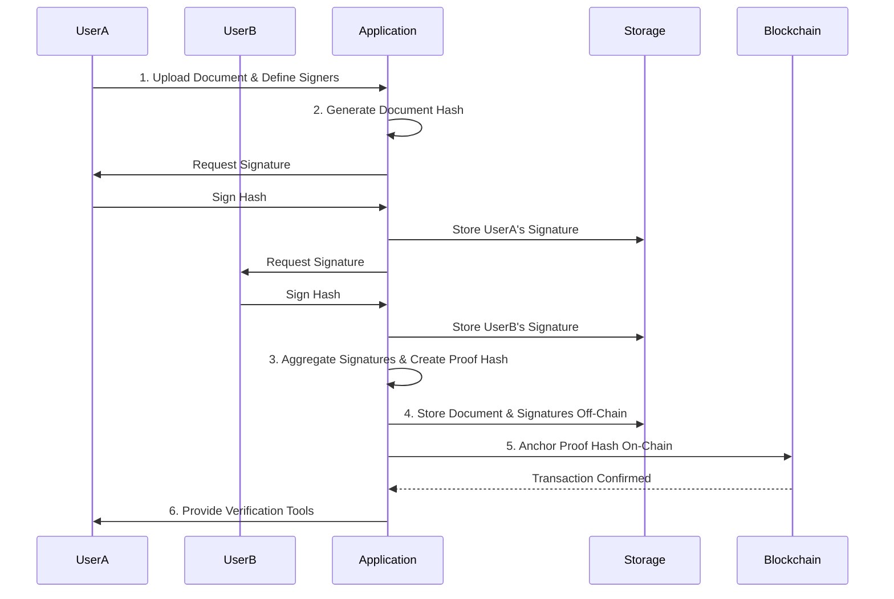

# Blockchain-Anchored Signing: Multi-Signature

This document details the process for securing a document with multiple signatures and anchoring it to a public blockchain. This method is ideal for high-value agreements requiring the consent of several parties, providing an immutable, auditable trail of the entire signing process.

## Process Overview

The process involves collecting multiple signatures off-chain, aggregating them, and then anchoring a hash of this aggregate proof to the blockchain.



## Step-by-Step Guide

### 1. Initiate Document and Define Signers

The process starts when a user uploads a document and specifies all the required signers.

*   **Action:** The initiator uploads a document and lists the required signers. The system sets up a workflow for collecting the signatures.
*   **Example:** A startup founder uploads a "Term Sheet.pdf" and invites three investors to sign it.

### 2. Generate and Distribute Document Hash

A single, unique hash of the document is generated to ensure all parties sign the exact same content.

*   **Action:** The application computes a SHA-256 hash of the "Term Sheet.pdf".
*   **Example:** Document Hash: `c1d2e3f4...`

### 3. Collect Signatures and Create Proof Hash

Each required party signs the document hash off-chain. Once all signatures are collected, the application creates a "proof hash" representing the complete, signed agreement.

*   **Action:**
    1.  Each investor signs the hash `c1d2e3f4...` using their private key.
    2.  The application collects all signatures.
    3.  A final proof hash is generated by hashing the combination of the document hash and all the collected signatures. This creates a single, verifiable fingerprint for the entire agreement.
*   **Example:**
    *   The three investors provide their signatures: `0xaaa...`, `0xbbb...`, `0xccc...`.
    *   The application creates a combined string: `c1d2e3f4...0xaaa...0xbbb...0xccc...`.
    *   A final SHA-256 hash of this combined string is computed: `Proof Hash: 8f9g0h1i...`

### 4. Store Document and Signatures Off-Chain

The original document, the individual signatures, and the final proof hash are all stored in an off-chain system.

*   **Action:** The "Term Sheet.pdf", the list of individual signatures, and the proof hash are stored securely in a database or distributed storage.
*   **Example:** The data is stored in a structured format:
    ```json
    {
      "document_hash": "c1d2e3f4...",
      "signatures": ["0xaaa...", "0xbbb...", "0xccc..."],
      "proof_hash": "8f9g0h1i..."
    }
    ```

### 5. Anchor Proof Hash On-Chain

The final proof hash is recorded on a public blockchain to create an immutable, timestamped record of the fully executed agreement.

*   **Action:** The application submits a blockchain transaction containing the `proof_hash`.
*   **Example:** A transaction is sent to the Ethereum mainnet with the data field containing `8f9g0h1i...`. The block timestamp provides a definitive time of agreement.

### 6. Provide Comprehensive Verification Tools

A verification tool allows any party to confirm the document's validity and the integrity of the multi-signature process.

*   **Action:** A user uploads the document. The tool:
    1.  Re-calculates the document hash.
    2.  Retrieves the associated signatures from off-chain storage.
    3.  Re-creates the proof hash by combining the document hash and signatures.
    4.  Searches the blockchain for a transaction containing this proof hash.
    5.  Verifies each individual signature.
*   **Example:** An external auditor uploads the "Term Sheet.pdf". The system confirms that its proof hash is anchored on the blockchain and that all three investor signatures are valid, proving the agreement is authentic and was fully executed at the time recorded on-chain.
## Required Services

*   **Blockchain:** A public or private blockchain to anchor the final proof hash.
*   **Secure Off-Chain Storage:** A reliable storage solution for the original document and individual signatures.
*   **Identity Provider:** An authentication service to verify the identities of all participants.
*   **Digital Wallet/Key Management:** A secure key management system for each signer.
*   **Notification Service:** A service to manage the signing workflow and notify participants.