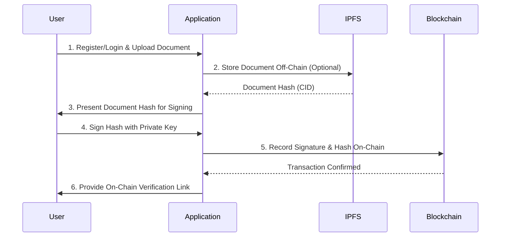

# On-Chain Signing: Single Signature

This document outlines the end-to-end process for signing a document with a single signature directly on a public blockchain. In this model, every step of the signing process is recorded on-chain, providing an immutable and fully transparent audit trail.

## Process Overview

The on-chain model ensures maximum security and transparency by recording the document hash and signature as a blockchain transaction. This makes the entire workflow verifiable by any party without relying on a central authority.

## Step-by-Step Guide

### 1. Register and Verify User Identity

Ensuring the signer's identity is the first critical step. This is typically handled through robust authentication mechanisms.

*   **Action:** The user registers or logs into the platform. Identity can be verified using enterprise Single Sign-On (SSO), OAuth, or a decentralized identity (DID) system.
*   **Example:** An executive logs into a secure portal using their corporate credentials, which are linked to a registered blockchain wallet address.

### 2. Upload and Prepare Document

The document to be signed is uploaded to the platform. To optimize costs and performance, the document itself is often stored off-chain.

*   **Action:** The user uploads the document (e.g., "Merger Agreement.pdf"). The system generates a unique cryptographic hash (e.g., SHA-256) of the document.
*   **Example:** The "Merger Agreement.pdf" is hashed, producing `0xabc...`. For decentralized storage, the document is uploaded to **IPFS**, and its Content Identifier (CID) is used as the document reference.

### 3. Generate Document Hash

A unique cryptographic hash of the document is created. This hash serves as the document's digital fingerprint for all subsequent operations.

*   **Action:** The application computes a SHA-256 hash of the "Merger Agreement.pdf".
*   **Example:**
    *   Document Hash: `a1b2c3d4...`

### 4. Sign Document Hash Using Private Key

The user signs the document hash using their private key. This is the core of the digital signature process.

*   **Action:** The user's blockchain wallet (e.g., MetaMask, Trust Wallet) prompts them to sign the document hash (`a1b2c3d4...`). The user approves, and the wallet generates a unique digital signature.
*   **Example:** The executive's wallet signs the hash, creating a signature string like `0xdef...`. This signature is cryptographically linked to their public key and the document hash.

### 5. Record Signature and Document Hash On-Chain

The signature, document hash, and other relevant metadata are recorded in a single, atomic transaction on the blockchain.

*   **Action:** The application calls a smart contract function (e.g., `addSignature`). The transaction includes the document hash, the signature, the signer's public key or address, and a timestamp.
*   **Example:** A transaction is sent to an Ethereum smart contract with the following parameters:
    *   `documentHash`: `0xa1b2c3d4...`
    *   `signature`: `0xdef...`
    *   `signerAddress`: `0x123...`
    *   The smart contract validates the signature and stores the data immutably.

### 6. Maintain Immutable On-Chain Audit Trail

Every action related to the document is recorded on the blockchain, creating a permanent and tamper-proof audit trail.

*   **Action:** The smart contract emits events for each action (e.g., `DocumentSigned`). These events can be monitored to track the document's status.
*   **Example:** Anyone can query the smart contract or use a block explorer (like Etherscan) to see that address `0x123...` signed the document with hash `0xa1b2c3d4...` at a specific block height and time.

### 7. Serve Verification Tools

The platform provides tools for anyone to independently verify the document's authenticity and the signature's validity.

*   **Action:** A verification tool allows a user to upload a document. The tool:
    1.  Re-calculates the document's hash.
    2.  Queries the blockchain to retrieve the signature and signer's address associated with that hash.
    3.  Cryptographically verifies that the signature was created by the signer's private key.
*   **Example:** A third-party auditor uploads the "Merger Agreement.pdf". The tool confirms its hash matches the one on-chain and verifies the executive's signature, proving the document is authentic and was signed by the authorized party.

## Required Services

*   **Blockchain:** A public or private blockchain (e.g., Ethereum, Polygon, Hyperledger Fabric) is required to immutably record transactions.
*   **Smart Contracts:** A set of smart contracts is needed to manage the signing logic, store data, and enforce rules.
*   **IPFS (InterPlanetary File System):** Recommended for decentralized, off-chain storage of the original document. This keeps the document secure and accessible without bloating the blockchain.
*   **Digital Wallets:** Users need a digital wallet to manage their private keys and sign transactions.
*   **Identity Provider:** An authentication service (SSO, OAuth, DID) to verify user identities before they can sign.