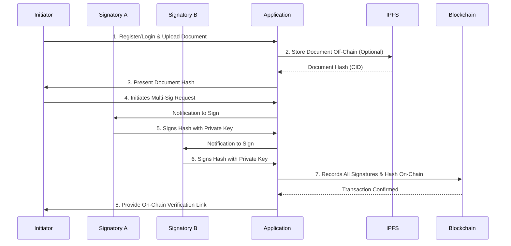

# On-Chain Signing: Multi-Signature

This document outlines the process for signing a document with multiple signatures directly on a public blockchain. The multi-signature (multi-sig) model requires two or more users to approve a transaction, providing a higher level of security for critical documents.

## Process Overview

The multi-signature workflow ensures that no single party can unilaterally approve a document. All required signatures are collected and recorded on-chain, creating a robust and transparent audit trail.

## Step-by-Step Guide

### 1. Register and Verify User Identities

All participating signatories must have verified identities linked to their blockchain wallets.

*   **Action:** All users (initiator and signatories) register or log in. Identities are verified via SSO, OAuth, or DIDs.
*   **Example:** A board of directors uses their corporate accounts to access the signing platform. Each member's account is linked to a unique, pre-registered wallet address.

### 2. Upload and Prepare Document

The document requiring multiple signatures is uploaded. As with the single-signature model, the document is typically stored off-chain.

*   **Action:** The initiator uploads the document (e.g., "Q4 Financial Report.pdf"). The system generates its SHA-256 hash.
*   **Example:** The report is hashed to `0x123...`. The document is stored on **IPFS**, and its CID is used as the reference.

### 3. Initiate Multi-Signature Request

The initiator starts the multi-signature workflow by defining the required signatories.

*   **Action:** The initiator specifies the wallet addresses of all required signatories (e.g., Signatory A, Signatory B).
*   **Example:** The CFO (initiator) uploads the financial report and adds the wallet addresses of the CEO and COO as required signatories.

### 4. First Signatory Signs Document Hash

The first signatory is notified and prompted to sign the document hash.

*   **Action:** Signatory A receives a notification, reviews the document (or its hash), and signs the hash using their private key.
*   **Example:** The CEO receives an email, logs in, and uses their wallet to sign the hash `0x123...`, producing signature `0xaaa...`.

### 5. Subsequent Signatories Sign Document Hash

The process continues sequentially or in parallel until all required signatures are collected.

*   **Action:** Signatory B is notified, reviews the document, and signs the hash.
*   **Example:** The COO signs the hash `0x123...`, producing signature `0xbbb...`.

### 6. Record All Signatures and Document Hash On-Chain

Once all required signatures are collected, the application bundles them into a single transaction to be recorded on the blockchain.

*   **Action:** The application calls a smart contract function (e.g., `executeMultiSig`) with the document hash and the list of signatures.
*   **Example:** A transaction is sent to an Ethereum smart contract with the following parameters:
    *   `documentHash`: `0x123...`
    *   `signatures`: [`0xaaa...`, `0xbbb...`]
    *   `signers`: [`0xCEO...`, `0xCOO...`]
    *   The smart contract verifies each signature against the corresponding signer's address and the document hash before storing the data.

### 7. Maintain Immutable On-Chain Audit Trail

The entire multi-signature process is immutably recorded, providing a complete and verifiable history.

*   **Action:** The smart contract logs events for each signature and the final execution, creating a transparent audit trail.
*   **Example:** A block explorer shows that the document hash `0x123...` was signed by both the CEO and COO, with timestamps for each signature, before being finalized in a specific transaction.

### 8. Serve Verification Tools

The platform provides tools for verifying the multi-signature document.

*   **Action:** A verification tool allows any party to upload the document and check its status. The tool:
    1.  Re-calculates the document's hash.
    2.  Queries the blockchain for the list of signatures associated with that hash.
    3.  Verifies each signature against the public key of the respective signatory.
*   **Example:** An external auditor uploads the "Q4 Financial Report.pdf". The tool confirms that the document was authentically signed by both the CEO and COO, as recorded on the blockchain.

## Required Services

*   **Blockchain:** A public or private blockchain with smart contract capabilities (e.g., Ethereum, Polygon).
*   **Smart Contracts:** A multi-signature smart contract wallet or a custom contract designed to manage multi-party signing logic.
*   **IPFS:** Recommended for off-chain storage of the document.
*   **Digital Wallets:** Required for all signatories to manage keys and sign transactions.
*   **Identity Provider:** To authenticate and verify all participants in the workflow.
*   **Notification Service:** To alert signatories when their action is required (e.g., email, push notifications).