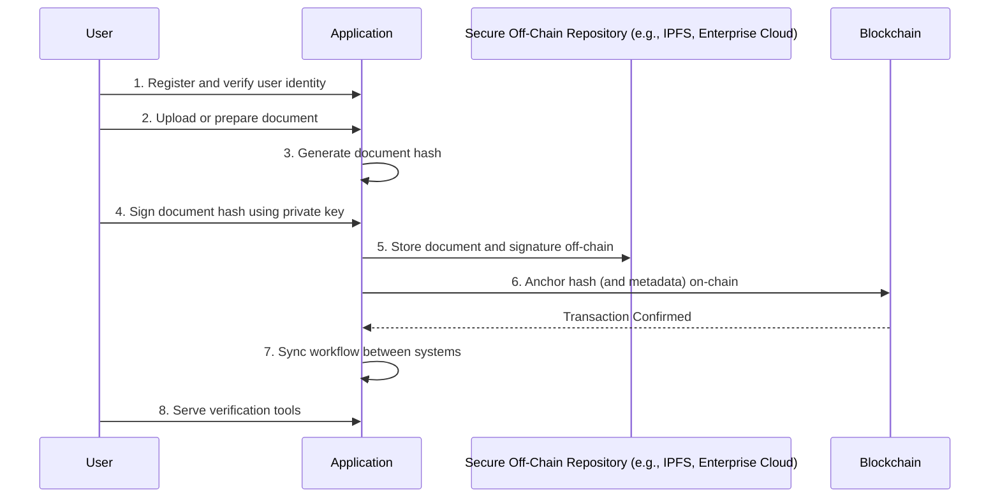

# Hybrid Model: Single Signature

This document outlines the step-by-step flow for signing a document using a hybrid model, where a single user's signature is applied. This approach combines off-chain storage and on-chain verification to ensure document integrity, signer authenticity, and data privacy.

## Process Overview

The hybrid model leverages the strengths of both on-chain and off-chain systems. The document and signatures are stored off-chain for privacy and scalability, while a cryptographic hash is anchored to the blockchain to provide an immutable, timestamped proof of the signing event.

## Step-by-Step Flow

### 1. Register and Verify User Identity
Users are authenticated using enterprise identities; roles and permissions are synchronized off-chain and referenced on-chain as needed.

*   **Action:** The user logs into the application using their verified enterprise credentials. The system confirms their identity and associated permissions.
*   **Example:** A legal counsel logs in with their corporate SSO (Single Sign-On). The application verifies their role and grants them permission to sign legal agreements.

### 2. Upload or Prepare Document
The document is stored in a secure off-chain repository (enterprise cloud, IPFS, or private server).

*   **Action:** The user uploads the document to be signed into the application.
*   **Example:** The legal counsel uploads a "Master Service Agreement.pdf" to the platform. The document is immediately transferred to a secure repository like a private AWS S3 bucket.

### 3. Generate Document Hash
A hash of the uploaded document is created for later reference.

*   **Action:** The application computes a unique cryptographic hash (e.g., SHA-256) of the "Master Service Agreement.pdf".
*   **Example:** Document Hash: `0xabc123...`

### 4. Sign Document Hash Using Private Key
Signers apply digital signatures to the hash using their private keys (within the application or secured key store).

*   **Action:** The user is prompted to sign the document hash (`0xabc123...`) with their private key, which is managed by a secure wallet or key store integrated with the application.
*   **Example:** The legal counsel uses their integrated wallet to sign the hash, producing a digital signature: `0xdef456...`.

### 5. Store Document and Signature Off-Chain
The original document and all related signatures are kept off-chain to protect privacy and allow for larger document sizes.

*   **Action:** The application stores the original "Master Service Agreement.pdf" and the signature (`0xdef456...`) in the secure off-chain repository.
*   **Example:** The document and signature are stored together, linked by metadata. For instance, in a database record: `{ doc_id: 'MSA001', doc_location: 's3://bucket/MSA.pdf', signature: '0xdef456...', signer: 'legal.counsel@acme.com' }`.

### 6. Anchor Hash (and Metadata) On-Chain
The system creates a blockchain transaction containing the document hash, reference pointers to the off-chain storage, metadata, and timestamp. This serves as an immutable record proof.

*   **Action:** The application broadcasts a transaction to the blockchain. The transaction data includes the document hash and a reference to the off-chain location.
*   **Example:** A transaction is sent to an Ethereum smart contract with the following data:
    *   `documentHash`: `0xabc123...`
    *   `storagePointer`: `s3://bucket/MSA.pdf`
    *   `signerAddress`: `0x123...` (Counsel's public key)
    *   This transaction creates a permanent, timestamped record of the signing event.

### 7. Sync Workflow Between Systems
Smart contracts or API bridges coordinate status and role updates between the blockchain and off-chain storage systems.

*   **Action:** Once the on-chain transaction is confirmed, the smart contract emits an event. An API bridge listening for this event updates the document's status in the off-chain database.
*   **Example:** The `DocumentSigned` event from the smart contract triggers an API call that updates the status of 'MSA001' in the database from `Pending Signature` to `Signed and Anchored`.

### 8. Serve Verification Tools
Users can download the original document, generate its hash, and verify the integrity and signatures by comparing with on-chain anchored hashes and events.

*   **Action:** The application provides a verification interface where any party can upload the document to check its authenticity.
*   **Example:** A third-party auditor uploads the "Master Service Agreement.pdf". The tool re-calculates its hash, queries the blockchain for that hash, retrieves the on-chain record, and confirms that the document was signed by the legal counsel at the recorded time.

## Required Services

*   **Blockchain:** A public or private blockchain (e.g., Ethereum, Polygon, Hyperledger Fabric) to anchor document hashes and record immutable proofs.
*   **IPFS/Secure Off-Chain Storage:** A distributed or centralized storage solution (e.g., IPFS, AWS S3, Google Cloud Storage) to securely store original documents and signatures.
*   **Identity Management:** An enterprise-grade identity provider (e.g., Okta, Azure AD) for user authentication and role management.
*   **API Bridges/Oracles:** Middleware services that facilitate communication between the blockchain and off-chain systems.
*   **Secure Key Store:** A wallet or key management system (e.g., MetaMask, Fortanix) to securely manage user private keys.