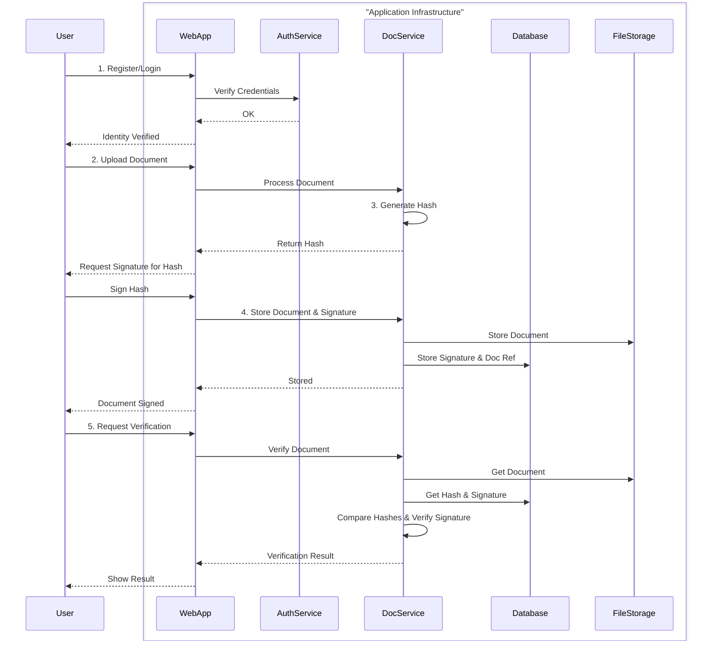
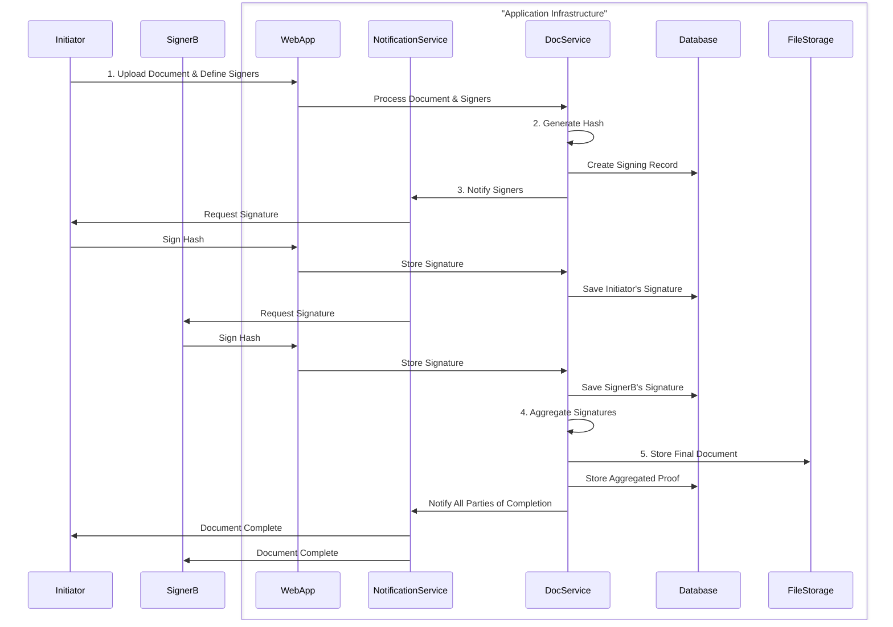
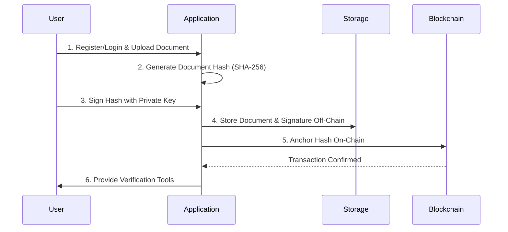
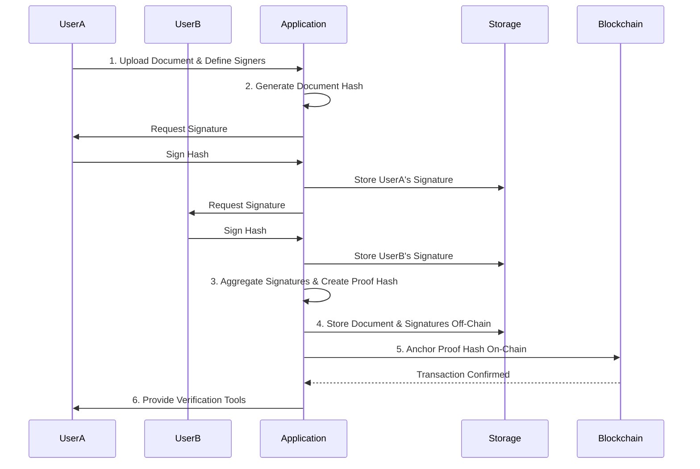
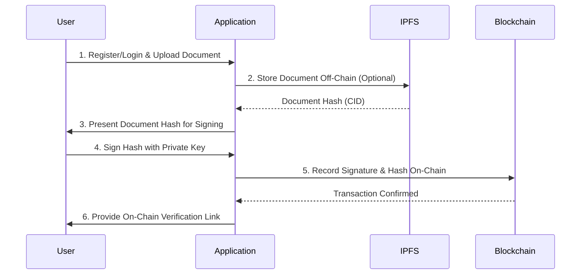
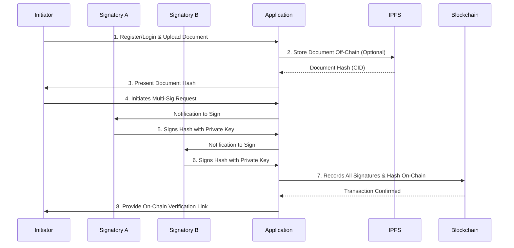
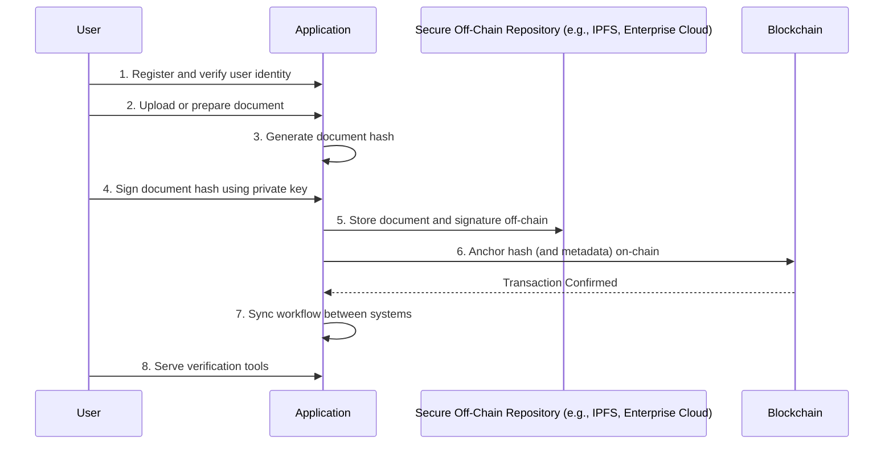
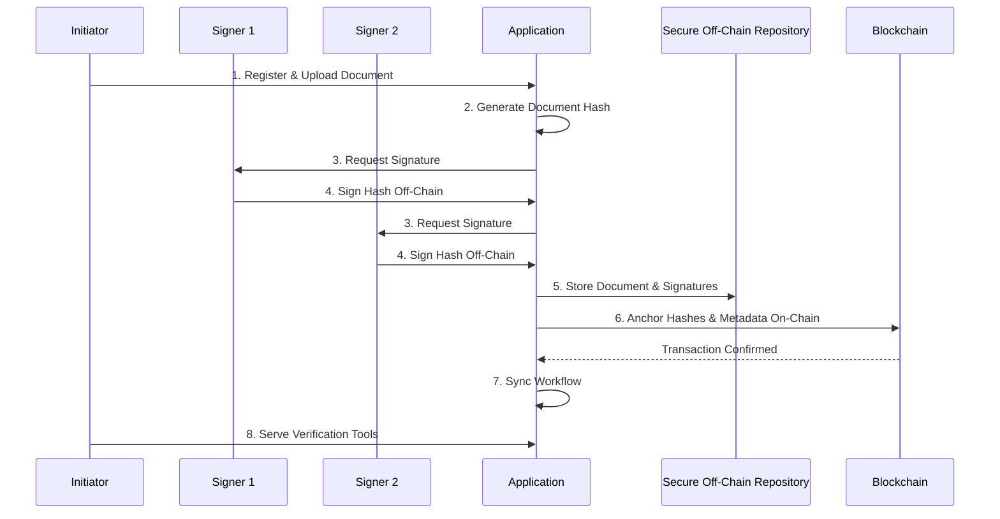

# Consolidated Model Steps for Document Signing

This document provides a centralized overview of the different models for document signing, covering both single and multi-signature flows. It is a consolidation of the individual model documents.

## 1. Off-Chain Document Signing

### 1.1. Single Signature

This model is for signing a document off-chain with a single digital signature, ensuring integrity and authenticity without blockchain transaction costs.

**Process Overview:**

**Step-by-Step Guide:**

1.  **Register and Verify User Identity:** The user's identity is established and verified.
2.  **Upload/Prepare Document:** The user uploads the document to be signed.
3.  **Generate Document Hash and Sign:** A SHA-256 hash of the document is generated, and the user signs this hash with their private key.
4.  **Store Document and Signature Off-Chain:** The original document and the signature are stored securely off-chain.
5.  **Serve Verification Tools:** The application provides tools to verify the document's authenticity and integrity.

### 1.2. Multi-Signature

This model is for signing a document off-chain with multiple digital signatures, which is essential for agreements requiring approval from several parties.

**Process Overview:**

**Step-by-Step Guide:**

1.  **Initiate Document and Define Signers:** The initiator uploads a document and specifies all required signers.
2.  **Generate Document Hash:** A single SHA-256 hash of the document is generated for all parties to sign.
3.  **Collect Signatures Sequentially or in Parallel:** The application requests and collects signatures from each required party.
4.  **Store Individual Signatures:** Each signature is stored off-chain, linked to the document and the signer.
5.  **Aggregate Signatures and Finalize:** Once all signatures are collected, they are aggregated into a complete proof of execution.
6.  **Store Final Document and Provide Verification:** The final document and aggregated signatures are stored, and verification tools are provided.

## 2. Blockchain-Anchored Signing

### 2.1. Single Signature

This hybrid approach combines off-chain storage with the immutability of a blockchain, providing a high level of trust and verifiability for a single-signature document.

**Process Overview:**

**Step-by-Step Guide:**

1.  **Register and Prepare Document:** An authenticated user uploads a document.
2.  **Generate Document Hash:** A SHA-256 hash of the document is created.
3.  **Sign the Hash Off-Chain:** The user signs the document hash with their private key.
4.  **Store Document and Signature Off-Chain:** The original document and signature are stored off-chain.
5.  **Anchor Hash On-Chain:** The document hash is recorded on a public blockchain.
6.  **Provide Verification Tools:** The application provides a public tool to verify the document's authenticity and timestamp.

### 2.2. Multi-Signature

This model secures a document with multiple signatures and anchors it to a public blockchain, providing an immutable, auditable trail of the entire signing process.

**Process Overview:**

**Step-by-Step Guide:**

1.  **Initiate Document and Define Signers:** The initiator uploads a document and lists the required signers.
2.  **Generate and Distribute Document Hash:** A single SHA-256 hash of the document is generated.
3.  **Collect Signatures and Create Proof Hash:** Each party signs the document hash off-chain. A final proof hash is generated by hashing the combination of the document hash and all collected signatures.
4.  **Store Document and Signatures Off-Chain:** The original document, individual signatures, and the proof hash are stored off-chain.
5.  **Anchor Proof Hash On-Chain:** The final proof hash is recorded on a public blockchain.
6.  **Provide Comprehensive Verification Tools:** A verification tool allows any party to confirm the document's validity and the integrity of the multi-signature process.

## 3. On-Chain Signing

### 3.1. Single Signature

In this model, every step of the signing process is recorded on-chain, providing an immutable and fully transparent audit trail for a single-signature document.

**Process Overview:**

**Step-by-Step Guide:**

1.  **Register and Verify User Identity:** The signer's identity is verified through robust authentication.
2.  **Upload and Prepare Document:** The document is uploaded, and its hash is generated. The document itself is often stored off-chain (e.g., on IPFS).
3.  **Generate Document Hash:** A SHA-256 hash of the document is created.
4.  **Sign Document Hash Using Private Key:** The user signs the document hash using their private key.
5.  **Record Signature and Document Hash On-Chain:** The signature, document hash, and other metadata are recorded in a single transaction on the blockchain.
6.  **Maintain Immutable On-Chain Audit Trail:** Every action is recorded on the blockchain, creating a permanent audit trail.
7.  **Serve Verification Tools:** The platform provides tools to independently verify the document's authenticity and signature.

### 3.2. Multi-Signature

This model requires two or more users to approve a document, with all required signatures collected and recorded on-chain for a robust and transparent audit trail.

**Process Overview:**

**Step-by-Step Guide:**

1.  **Register and Verify User Identities:** All participating signatories must have verified identities.
2.  **Upload and Prepare Document:** The document is uploaded, and its hash is generated.
3.  **Initiate Multi-Signature Request:** The initiator defines the required signatories.
4.  **First Signatory Signs Document Hash:** The first signatory signs the document hash.
5.  **Subsequent Signatories Sign Document Hash:** The process continues until all signatures are collected.
6.  **Record All Signatures and Document Hash On-Chain:** All signatures are bundled into a single transaction and recorded on the blockchain.
7.  **Maintain Immutable On-Chain Audit Trail:** The entire multi-signature process is immutably recorded.
8.  **Serve Verification Tools:** The platform provides tools for verifying the multi-signature document.

## 4. Hybrid Model

### 4.1. Single Signature

This model combines off-chain storage and on-chain verification to ensure document integrity, signer authenticity, and data privacy for a single-signature document.

**Process Overview:**

**Step-by-Step Guide:**

1.  **Register and Verify User Identity:** Users are authenticated using enterprise identities.
2.  **Upload or Prepare Document:** The document is stored in a secure off-chain repository.
3.  **Generate Document Hash:** A hash of the document is created.
4.  **Sign Document Hash Using Private Key:** The user signs the document hash.
5.  **Store Document and Signature Off-Chain:** The original document and signature are kept off-chain.
6.  **Anchor Hash (and Metadata) On-Chain:** The document hash and metadata are anchored to the blockchain.
7.  **Sync Workflow Between Systems:** Smart contracts or API bridges coordinate status updates between systems.
8.  **Serve Verification Tools:** Users can verify the document's integrity and signatures.

### 4.2. Multi-Signature

This model is for scenarios requiring agreement from multiple parties, combining off-chain signature management with an on-chain, timestamped proof.

**Process Overview:**

**Step-by-Step Guide:**

1.  **Register and Prepare Document:** An authenticated user uploads a document and specifies the required signers.
2.  **Generate Document Hash:** A unique hash of the document is created.
3.  **Request Signatures:** The application notifies each required signer.
4.  **Sign Document Hash Off-Chain:** Each signer independently signs the document hash.
5.  **Store Document and Signatures Off-Chain:** The original document and collected signatures are stored off-chain.
6.  **Anchor Hash (and Metadata) On-Chain:** A single transaction is created on the blockchain to anchor the proof.
7.  **Sync Workflow Between Systems:** The on-chain event triggers updates in the off-chain system.
8.  **Serve Verification Tools:** The application provides a tool to verify the document and its signatures.
## 5. Consolidated Required Services

This section provides a comprehensive list of all services required across the different signing models. Depending on the chosen model, a subset of these services will be necessary.

*   **Identity Provider/Management:** An authentication service (e.g., SSO, OAuth, DIDs, Okta, Azure AD) to verify user identities and manage roles.
*   **Secure Off-Chain Storage:** A reliable storage solution (e.g., IPFS, AWS S3, Google Cloud Storage, or a private server) to hold original documents, signatures, and related metadata.
*   **Database:** A database system (e.g., PostgreSQL, MySQL) to store metadata, document references, signatures, and manage workflow states.
*   **Digital Wallet/Key Management/Secure Key Store:** A system for users to securely manage their private keys and create digital signatures (e.g., MetaMask, Trust Wallet, Fortanix).
*   **Blockchain:** A public or private blockchain (e.g., Ethereum, Polygon, Hyperledger Fabric) to anchor document hashes, record immutable proofs, and execute smart contracts.
*   **Smart Contracts:** A set of smart contracts to manage the signing logic, store data, enforce rules, and handle multi-signature workflows.
*   **Notification Service:** A service (e.g., email, SMS, SendGrid, AWS SNS) to alert signatories when their action is required.
*   **API Bridges/Oracles:** Middleware services that facilitate communication and sync state between the blockchain and off-chain systems.